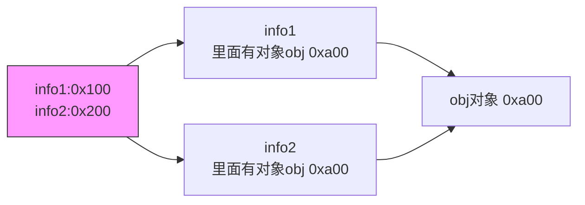
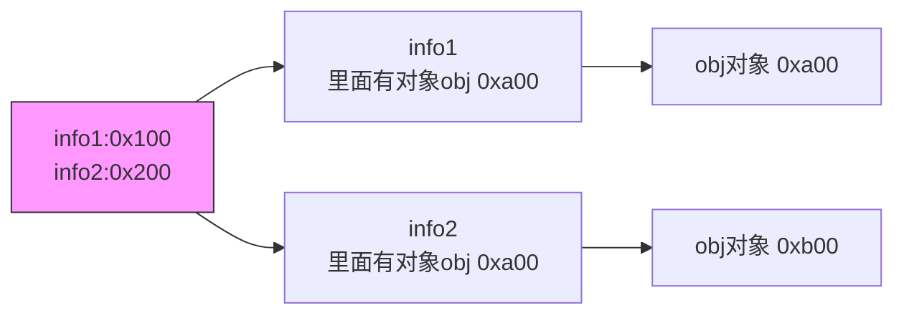

[TOC]

## 函数高级

### this的绑定规则

```js
  <script language="javascript">

    function foo() {
      console.log("fooc" + this);
    }
    //直接调用
    foo(); // 输出：foocWindow
    //对象调用
    let obj = { name: "john" };
    obj.foo = foo;
    obj.foo(); // 输出：fooc[object Object]
  </script>
```

1.函数在调用，默认绑定this

2.this的绑定和定义的位置没有关系

3.绑定和调用方式和调用位置有关系

4.this是在运行时被绑定

<hr>


默认绑定：

独立函数调用

函数定义在对象中，但是独立调用

高阶函数，实际还是独立函数调用

严格模式以上都是undefined


隐式绑定

通过一个对象来另外调用


new绑定

1. 创建空对象
2. this指向空对象
3. 执行函数体带啊
4. 没有显示返回非空对象时，默认返回this


显式绑定 

```js
let obj = {
	name: 'test'
}

function foo(){
	console.log(this);
}
//执行函数，并且强制this就是obj对象
foo.call(obj);//apply方法也可以
```

> apply第一个参数绑定this，后面的参数以数组形式传入实参
>
> ```js
> foo.apply(obj,['ceshi',18,30]) 
> ```

> 类似的call方法直接放参数列表即可
>
> func.call(thisArg,arg1,arg2,...)

现在我们可能在一个js部分多次对obj1调用foo函数，但是如果像上面一样，每次调用都要强调是obj1，其实是很赘余的，所以我们使用bind方法

```js
function foo(){
	//具体函数实现
}
  
let bar = foo.bind(obj);

bar();
```

<hr>


内置函数绑定

定时器绑window

事件监听绑对应被监听对象

forEach绑window


### 四种规则的优先级

1.默认规则的优先级最低

2.显式绑定先于隐式绑定

3.new绑定先于隐式绑定

> new不和apply以及call一起使用，所以不存在先后关系 

4.bind绑定先于默认绑定

> new绑定先于bind绑定


this规则之外-忽略显式绑定

1.显式绑定中传入null和undefined，这会被忽视，采取默认绑定

2.间接函数引用


#### 箭头函数

```js
function foo1(){};
let foo2 = function(){};

let foo3 = () => {
	//箭头函数
};
```

> 这不绑定this和argumenss，不能作为构造函数来使用

#### 编写优化

1.如果只有一个参数，()可以省略

```js
objs.forEach(item => {
	//函数部分
})
```

2.如果函数体只有一行代码，函数体的{}也可以省略

```js
objs.forEach(item => console.log(item);)
```

> 如果这里要return的话return也一起省略

3.返回一个对象的话，就要在对象外面再加一个括号


箭头函数的this绑定

箭头函数不存在this，由于这个特性，在箭头函数中使用this他会自动向上找，那么在一些使用


## 浏览器原理

### 网页的解析过程

一个网页url是怎么渲染的

#### 浏览器的渲染流程

浏览器的内核，先加载HTML，再解析HTML，如果有引入新的文件，就下载对应文件；同时继续解析，创建DOM的tree


先解析html，生成对应的dom_tree，再解析css，有了html和css生成render tree，这样以后进行布局和绘制

### 回流和重绘解析

第一次确定节点的位置和大小就称之为布局，后面再进行修改重新计算的行为就叫回流

> 1. 改变dom结构
> 2. 改变布局
> 3. 修改窗口尺寸
> 4. 调用一些方法获取尺寸和位置信息

第一次渲染内容称绘制，之后重新渲染称重绘

> 1. 修改背景色，文字颜色

回流一定引起重绘，回流很消耗性能

开发中尽量避免回流

> 1. 修改样式尽量一次性修改
> 2. 避免频繁操作DOM
> 3. 避免通过getcomputedstyle获取尺寸位置等信息
> 4. 对某些元素使用绝对定位和fixed定位

#### 合成和性能优化

特殊解析-composite合成

绘制的过程，可以将布局后的元素绘制到多个合成图层当中

默认情况，标准流绘制在同一个图层

一些特殊的属性，会创建一个新的合成层，新的图层利用GPU来加速绘制

- 每个合成层都是单独渲染的

浏览器在解析HTML的过程中，遇到sc元素是不能构建DOM树的，停止构建，首先下载js代码，执行js脚本。在这完成以后，继续解析HTML，构建DOM树

但是如果我们始终是先构建了DOMtree再执行脚本，可能会导致回流和重绘，影响页面性能

导致的问题——在现代开发模式中，脚本往往很多，这就导致处理时间很长，导致严重的加载阻塞

为了解决上面的矛盾，我们引入下面的**defer和async属性**

##### defer和async属性

defer会告诉浏览器不要等待脚本下载，继续解析HTMl，构建DOMtree，如果脚本提前下载好，会在DOMcontentloaded完成以前执行  

async不能保证顺序，独立下载，独立运行，不等待其他脚本

| 特性         |         `async`          |              `defer`               |
| :----------- | :----------------------: | :--------------------------------: |
| **加载时机** | 尽快加载，不阻塞文档解析 | 延迟加载，文档解析完成后按顺序执行 |
| **执行顺序** |      不保证执行顺序      |       按文档中出现的顺序执行       |
| **适用场景** | 不依赖其他脚本的独立脚本 |   需要在文档解析完成后执行的脚本   |

- **使用 `async`**：如果你的脚本是独立的，不需要依赖其他脚本，可以使用 `async` 属性来提高页面的加载速度。
- **使用 `defer`**：如果你的脚本需要在文档解析完成后执行，或者脚本之间有依赖关系，可以使用 `defer` 属性来确保脚本的执行顺序。


### JavaScript的运行原理

#### V8引擎原理

浏览器内核主要是两部分，一个解析HTML，一个解析JS代码

V8是CPP编写的谷歌开源的高性能的JS和WebAssembly引擎

V8引擎的架构

<h5> 
	<hr>
</h5>


JS在执行代码之前，会先在堆内存创建一个全局对象

global object

所有作用域均可访问，还有一个window属性指向自己

引擎内部有一个执行上下文栈


#### 认识VO对象

每一个执行上下文关联一个VO对象，变量和函数声明都添加到这个VO变量中

当全局代码被执行的时候，VO就变成GO对象了

(没看完)

<hr>


## 闭包

### JS的函数式编程

### 闭包的定义

cs中这么定义闭包：
词法闭包/函数闭包，实现上是一种结构体，存储一个函数和一个关联的环境


MDN:

一个函数对齐周围状态的引用捆绑在一起，这样的组合就是闭包

从广义上来说，JS中有函数就有闭包

狭义来说，访问了外层作用域的变量，才是一个闭包


```js
  <script>

    function createAdder(cnt) {
      function adder(num) {
        return num + cnt;
      }

      return adder;
    }

    let adder5 = createAdder(5);

    console.log(adder5(10)); // 15
  </script>
```


#### 闭包的内存泄露

永远不会再使用的对象，仍然占据内存而未被处理的现象叫做内存泄露


**未清理的闭包**

```javascript
function createClosure() {
  const bigData = new Array(1e6).fill('*'); // 10MB 数据
  return () => console.log(bigData.length); // 闭包持有 bigData 引用
}
const closure = createClosure();
```

**解决方案**：

- 及时解除引用：`closure = null;`
- 使用 WeakMap/WeakSet（弱引用不阻止 GC）


### 函数对象的属性

JS中函数也是对象，就有对应的方法

> 函数有自己的属性name就是函数名
>
> length是参数的个数
>
> 函数可以放在数组里面
>
> ...arg的剩余参数
>
> ```js
>function Foo(...args) {
> 		console.log("test");
> //这里传参是任意数目，这里不在length数目里面
> 	}
> ```


arguments是一个**类数组对象**，

1.可以通过索引获取内容来遍历

2.获取所有参数中的偶数

实际是对象类型，很多数组方法是无法使用的。实际开发中有时需要将他转化为数组类型

```javascript
//1.
let newArr=[];
for(let ch of arguments){
  newArr.push(ch);
}

//2
let newArr1 = Array.form(arguments);
let newArr2 = [...arguments];

//3
let newArr3 = [].slice.apply(arguments);
```


**箭头函数不绑定arguments**

所以当在箭头函数中调用arguments的时候是和一般变量一样，会去上层作用域找是否存在一个arguments


函数的剩余参数(rest)

```js
function(a , ...arg) {
	console.log(arg);//这是一个数组类型，剩余参数要写到最后
}
```


#### 理解JS的纯函数

函数式编程存在一个纯函数的概念

> 相同输入时产生相同输出
>
> 和输入输出以外的隐藏无关，和I/O设备的输出无关
>
> 不能有触发事件，使设备输入输出的“副作用”


计算机中的副作用表示，在执行一个函数时，除了返回函数值，还对调用函数产生了附加的影响，比如修改全局变量，修改参数或改变外部存储

---

数组slice和splice

slice是一个纯函数不修改原数组

splice不是纯函数，会修改原函数


纯函数的作用优势

```markdown
1.写的安心，不用去关心外层作用域的值，是什么状态

2.用的安心，调用函数时，确定的输入一定产生确定的输出
```

> 纯函数在react使用很多，react也倾向于所有组件必须像纯函数一样保护props不被更改


#### 柯里化(currying)

概念:是把接受多个参数的函数，变成接受一个单一参数的函数，并返回接受余下的参数，返回结果的新函数的技术

柯里化声称<font color="#ff6497">如果你固定某些参数，你将得到接受余下参数的一个函数</font>

```js
// 普通的加法函数
function add(a, b) {
  return a + b;
}

console.log(add(2, 3)); // 输出 5

// 柯里化的加法函数
function curriedAdd(a) {
  return function(b) {
    return a + b;
  };
}

const add2 = curriedAdd(2);
console.log(add2(3)); // 输出 5
console.log(curriedAdd(2)(3)); // 输出 5
```


柯里化函数的箭头函数写法

```js
function foo = x=> y=> z=> console.log(x+y+z);
```

> 1.手动转换
>
> 2.封装函数：自动转化柯里化过程
>
> ​	/1.返回一个新函数，继续接受参数
>
> ​	/2.直接执行fn
>
> 3.对其他函数柯里化

```js
    function hyCurrying(fn) {
      function curried(...arg) {
        if (arg.length >= fn.length) {
          fn(...arg);
        } else {
          return function (...newArgs) {
            return curried(...arg.concat(newArgs));
          }
        }
      }

      return curried;
    }
```

但这个还是有点复杂，所以实际开发的时候，如果一个函数需要柯里化处理，我们在写的时候就把他柯里化，避免再将这个函数去柯里化


### 组合函数

一种函数的使用技巧和模式

假如说一个操作要依次执行fn1和fn2，我们可以将两个函数一起处理

```js
function add5(num){
	return num + 5;
}

function plus2(num){
  return num *2;
}

function add5Puls2(num){
  return add5(plus2(num));
}
```


组合函数自动封装

```js
function composeFn(...fns){
	//1.边界判断
  let length = fns.length;
  for(let fn of fns){
		if(typeof fn !== "function"){
      throw new Error("fn must be a function")
    }
  }
  //2.返回新函数
  return function(...args){
		let result = fns[0].apply(this,args)
    for(let i = 1; i < length; i++){
      let fn = fns[i]
      reslut fn.apply(this.[result]);
    }
    return result;
  }
}
```

#### ~~with语句~~

```js
let obj = {
  msg = "test";
}

with (obj) {
	console.log(msg);
}
```

<font size=4><u>不推荐使用</u></font>，兼容性问题

#### ~~eval函数~~

将传入的字符串当作js代码来执行

<u>不建议使用</u>，可读性差，容易被攻击，不能被js引擎优化


***

### 认识严格模式

#### 局限性

为了兼容旧的代码很多错误的不完善的东西也被留存了


ES5提出了严格模式，提出一种具有限制性的JS模式

有如下限制：

​		通过抛出错误来消除一些原有的silent错误

​		引擎执行代码可以进行更多优化

​		禁用了一些未来版本可能会定义的一些语法

严格模式的使用也是类似于作用域的

在文件或者函数开头使用

```js
"use strict"
```

class和module是自动启用strict的

***

##### 严格模式的常见限制

1. 不能意外创建全局变量
2. 发现一些静默错误
3. 试图删除一个不可删除的属性
4. 不能以0开头(8进制的历史遗留)
5. 不允许函数参数有相同的名称
6. 不允许使用with
7. 不再为上层引用变量
8. this不会转变为对象类型
   独立函数默认模式下，绑定window对象，在严格模式绑定undefined


***

### 属性描述符

我们要怎么对对象的属性进行一个比较精准的操作控制呢，就可以使用属性描述符

```js
Object.defineProperty(obj,prop,descrip)
```

- 定义属性的对象
- 要定义或者修改属性的名称
- 要定义或者修改的属性描述符

返回被修改的对象

有两种：

#### 数据属性和存储属性

- ###### 数据属性

```js
Object.defineProperty(obj,"name",{
  configurable:false,//表示不可删除，且不可修改
  enumerable:false,//是否可以被遍历，不可枚举
  writeable:false,//是否可以被写入（只读属性）
  value:"demo"，//返回这个结果
  //直接定义对象属性这个值默认是true的
	//通过Object.defineProperty添加属性，这个值默认false；
});
```

- 存储属性（响应式）

```js
Object.defineProperty(obj,"name",{
  configurable:false,//表示不可删除，且不可修改
  enumerable:false,//是否可以被遍历，不可枚举
  set: function(value){
    console.log(value);
    //设置过程自动调用
  }
  get: function(){
		console.log();
  	//获取的时候调用
	}
 });
```

***

获取属性描述符

```js
Object.getOwnPropertyDescriptors(obj);
```

***


## 对象和函数的原型

### 对象的原型

```js
obj.__proto__;
Object.getProtoytypeOf(obj);
```

这个原型有什么用呢？

当我们通过[get]的过程方式获取一个属性对应的value时，会优先在对象中查找；如果找不到就在原型对象中查找

```javascript
// 定义一个类
class Animal {
  constructor(name) {
    this.name = name;
  }

  // 定义方法
  sayName() {
    console.log("My name is " + this.name);
  }
}

// 创建实例
const dog = new Animal("Rex");
const cat = new Animal("Whiskers");

// 调用实例方法
dog.sayName(); // 输出: My name is Rex
cat.sayName(); // 输出: My name is Whiskers

// 访问原型对象
console.log(Object.getPrototypeOf(dog) === Animal.prototype); // true
```

- 将函数看成特殊的对象，函数也具备这种_\_proto__属性

- 将函数看成一个函数，它是具备prototype的
  构建对象时，给一个隐式属性

> 对于一个对象，包括成为对象的构造函数
>
> 这个obj._\_proto__===Object.getPrototypeOf(obj)都为true

### new操作符

> 1.创建一个空对象
>
> 2.将这个空对象赋值给this
>
> 2.5将函数的显式原型赋值给对象作为隐式原型
>
> 3.执行函数体代码
>
> 4.返回对象

以上面的代码为例

```
Animal.prototype
//{sayName: ƒ}

dog.sayName
//ƒ sayName() {
    console.log("My name is " + this.name);
  }
Object.getPrototypeOf(dog)
//{sayName: ƒ}
```


```js
function Student(name, age, grade) {
      this.name = name;
      this.age = age;
      this.grade = grade;
      
      //this.getInfo= function () {
      //return `${this.name} ${this.age} ${this.grade}`;
      //如果这样写，实际每次使用函数都是创建函数
    }
    Student.prototype.getInfo = function () {
      return `${this.name} ${this.age} ${this.grade}`;
      //使用原型，就可以避免这种多次创建的过程
    }

    let stu1 = new Student("John", 18, 10);
    let stu2 = new Student("Mary", 17, 9);
    console.log(stu1.getInfo()); // John 18 10
    console.log(stu2.getInfo()); // Mary 17 9
    console.log(stu1.getInfo === stu2.getInfo); // true
```

这是ES5的写法 [ 实际是类似于类的？]

***

### 显式原型的constructor属性

默认情况下，原型上都会添加一个属性叫做constructor，这个属性指向当前的函数对象

```
function的prototype是显式原型对象
显式原型对象的constructor是function
```


函数原型对象赋值新的对象

重写函数原型对象

```js
//直接赋值写新原型
Person.prototype= {
	//代码块
  constructor:Person,//指向原本的constructor
}

```

但原本自带的constructor是不可枚举的，自己重新再写的，会变成enumerable的，所以重写需要再去赋值为false；

```js
//使用类方法
Object.defineProperty(Person.prototype,"constructor"){
	value: "",
}
```

***

## 面向对象的特性

面向对象有如下特性封装 继承 多态

封装：就是将属性和方法封装到一个类中

继承：子类可以拥有自己的属性和方法，同时继承父类的属性和方法

多态：不同的对象在执行时表现出不同的形态

### 继承

### JS原型链

这里我们先了解JS原型链的概念

在查找时我们存在这样一个链式的过程，先在本体查找，如果没有就到obj._\_proto__的对象查找，再递归进行。直到找到，或者某个对象的原型是null

有了原型链，我们就可以完成继承的过程，子类没有的方法写到父类里面去

利用原型链实现继承

```js
//不要使用Student.prototype=Person.prototype
//这是一个地址赋值，现在共享了一个原型，对子类的修改也会延申到父类上

//可以创建父类的一个实例对象再继承

let p = new Person (..args);
Student.prototype = p;
```

但是上述原型链也存在很多问题，我们通过p的实例对象创建的某些属性实际保存也在p上，

1. 直接打印看不到这个属性
2. 这个属性被多个对象共享，但实际我们肯定希望尽管是父类属性，但子类继承下来也应该不同
3. 不能给Person传递参数，因为这个对象的一次性创建

为了解决这些问题，我们使用.call的构造函数

```js
function Student(name,age,major,id){
	Person.call(this,name,age);
  this.major = major;
  this.id = id;
}
//ES5写法
class Student extends Person {
      constructor(name, age, major,id) {
        super(name, age);
        this.major = major;
        this.id = id
      }
		}
//ES6写法
```

这种ES5的写法称为组合继承

组合继承是否完美呢？其实仍然存在一些问题

- 无论在什么情况下都调用两次父类构造函数
  一次在创建子类时，
  一次在子类构造函数内部
- 所有子类实例事实上拥有两份父类的属性

#### **寄生组合式继承**

 **方案一**

```js
function F(){};
F.prototype = Person.prototype;
Student.prototype = new F();
```

**方案二**

```js
let obj = Object.create(Person.prototype);
Student.prototype = obj;
```


```js
function inherit(Subtype,Supertype){
	Subtype.prototype =  Object.create(Supertype.prototype)
}
```


```js
function Parent(name) {
  this.name = name;
}

Parent.prototype.sayName = function() {
  console.log(this.name);
};

function Child(name, age) {
  Parent.call(this, name);
  this.age = age;
}

// 寄生组合式继承
//这个部分可以单独封装继承函数
(function() {
  var F = function() {};
  F.prototype = Parent.prototype;
  Child.prototype = new F();
  Child.prototype.constructor = Child;
})();

Child.prototype.sayAge = function() {
  console.log(this.age);
};

// 示例
var child = new Child("Alice", 20);
child.sayName(); // Alice
child.sayAge();  // 20
```

***

#### Object类是所有类的父类


***

##### 一些其他

- hasOwnProperty，检验是否拥有自己的属性，即除了父类的属性
- in操作("name" in obj)，是否有某个属性，沿着原型链来查找
- instanceof，用来检测某个对象和构造函数的prototype，是否出现在某个实例对象的原型链上
- isPrototypeOf，Student.prototype.isisPrototypeOf(stu)，检测Student是否出现在这个示例对象的原型链中，Person也为true


## ES6中类的使用

### 原型继承关系图

对于JS中函数的特殊性，创建一个函数时，实际也是创建一个对象，是在new function的一个过程所以所有函数的.\_\_proto\_\_都是Function.prototype，并且Function也是对象，所以，它的\_\_proto\_\_也会指向Object的显式原型。

- student是Studen的实例对象

- obj是Object的实例对象

- Function Object 都是Function的实例对象

- 原型对象默认创建时，隐式原型都是指向Object的显式原型的

- Object是Function的父类

  ***

添加到原型上面的方法就叫做实例方法，这种方法必须以实例来调用。

如果我们要对函数本身给方法，这种方法叫类方法

```js
foo.nameOfFunction = function() {};
```

### class定义类

ES6虽然产生了class关键词，但本质还是ES5的构造函数，原型链的语法糖

```javascript
class Person(){
  //当我们用new创建对象时默认使用constructor创建
  //只能有一个
  constructor(...args){
    //依旧使用this
    //this.name = name
  }
  //实例方法
  //这样的语法，是将方法放在prototype里面
  nameOfFunction(){
		
  }
}
```

***

类的访问器语法

```javascript
class Person(){
  constructor(...args){
  }
  nameOfFunction(){
	
  }
  //以_开头的变量，不要在外部使用
  set name(val){
		this._name = val;
  }
  get name(){
    return this.name;
  }
 }
```

访问器的使用场景

```javascript
   class Rectangle {
      constructor(x, y, width, height) {
        this.x = x;
        this.y = y;
        this.width = width;
        this.height = height;
      }

      get position() {
        return {
          x: this.x,
          y: this.y
        };
      }

      set position(pos) {
        this.x = pos.x;
        this.y = pos.y;
      }
    }

    let rect = new Rectangle(10, 20, 30, 40);
    console.log(rect.position); // {x: 10, y: 20}
    rect.position = { x: 50, y: 60 };
    console.log(rect.position); // {x: 50, y: 60}
```

这样就可以以对象的形式返回数据了
**类中的静态方法**

就是在方法前加static关键词

静态方法是属于类本身的方法，而不是实例对象的方法

实例对象的方法我们用obj.function()调用，而静态方法是class.function()的方法调用

#### extends实现继承

```javascript
//如果Person作为父类
class Student extends Person {
  constructor(name,age,id,major){
		super(name,age);
    this.id = id;
    this.major = major;
  }
}
```

**父类方法的重写**

就是把同一个名字的函数自己再写一遍，沿原型链的特性

还可以使用super.function，继续调用父类的方法(在父类的基础上额外写内容)

**继承自内置类**

```js
class MyArray extends Array{
	get lastItem(){
    return this[this.length-1];
  }
}
```

```javascript
//自修改
Array.prototype.lastItem = function(){
  return this[this.length-1];
};
```

**类的混入**

JS只支持单继承

一个子类只能有一个父类

```javascript
function mixinAnimal(baseClass){
	return class extends baseClass {
    running(){
      //代码块
    }
  }
}
```


##### babel实现ES6转ES5

<font color="#ff6497"> [没看记得补] </font>

##### 面向对象的多态

> 有继承(实现接口)
>
> 父类引用指向子类对象

简单来说多态就是，对于不同的数据类型进行同一个操作，展现出不同的结果，就是多态

## ES6对象增强

### 对象字面量的增强

1. 属性的简写
2. 方法的简写
3. 计算属性名

```javascript
//在某个对象已经有属性的变量以前，比如
let name = '小明';
let obj = {
	name: name,
};
//可以简写为
let obj = {
	name,
};
//不仅在创建对象时可以这么做，返回对象也可以
function returnNeedObj(){
  let msg = "hello world";
  let num = 42;
  return { msg, num };
};//只是语法糖，本质是相同的
```

```javascript
let obj = {
	running: funtion(){
  	console.log("run");
	}
  swimming(){
    console.log("swim");
  }
//这两种写法的this都是对象
//箭头函数的this是window
}
```

```javascript
//现在我们有这样一个需求，将外部的变量作为key，放入对象，使得更灵活
let key = address;
let obj = {
	[key]： "chengTu"
  //实际就是address: chengTu
}
```

***

解构Destructuring

```javascript
let nums1 = [1,2,3,4];
let [n1,n2,n3] = nums1;
console.log(n1,n2,n3="-1");
//如果n3的位置是undefined,就会默认n3是-1
//有严格的顺序
[n1, ,n3] = nums1;
//对象的解构是不分顺序的，根据key值来解构
//对变量进行重命名
let {height: wHeight,name: wName,age: wAge} = obj
console.log(wHeigh,wName,wAge);
```

***

Function原型的apply call bind方法

<font color="#ff6497"> [没看记得补] </font>

新的ECMA代码执行描述

- 执行上下文栈
- 执行上下文
- 变量对象 全局对象 激活对象
- 作用域链


***

### let/const的基本使用

- const的主要特性是不能修改
- 如果赋值的是引用类型，可以通过引用找到相应的对象进行修改

let-const没有作用域提升和暂时性死区

```javascript
//let存在块级作用域的概念

//并且因为let的部分，产生了暂时性死区
//即是不能先
//console,log(b); let b=2;这样来做
```

let-const具备块级作用域

具有let const function的标识符的部分会产生作用域，形成新的词法环境

***

- 优先使用const，保证数据的安全性，不会被随意的篡改
- 明确知道一个变量后续会被重新赋值时，再使用let

***

## ES6中的新语法

### 模板字符串

```javascript
const name = " ";
const age=" ";

const str = `my name is ${name}, age is ${age}`;
```

标签模板字符串

```javascript
function doo(...args){
	console.log(args);
}

doo `15,name,do`;//会将这些传入
doo `my name is ${name}, age is ${age}`;//自然以逗号分割 
```


React是all in js的框架

### 默认参数写法

```javascript
function foo(arg1){
	arg1 = (arg1 === undefined || arg1===null) ? "默认" : arg1;
}

//或者??
//arg1 = agr1 ?? "默认" 效果和上面其实是差不多的

function foo(arg1 = '默认'){
		//只处理undefined，不处理null
}
```

- 有默认参数的尽量写在后面
- 有默认参数的形参，不会计算在length之内

默认参数可以和解构一起使用

当我们需要使用对象作为默认参数的时候，就可以使用解构


### 箭头函数补充

1. function定义的函数有两个原型
2. 箭头函数没有显式原型prototype

所以不要使用箭头函数作为构造函数，而是使用ES6的语法糖class

### 展开语法 拷贝

<span id="top">展开语法 拷贝</span>

```javascript
const names = [];
function foo(name1,name2,...args){
  console.log(name1,name2,...args);
}

foo(...names);//这里会把names每个元素单独拿出来，挨个放进对应变量
//如果放入字符串，要切分为单个字符
//这里针对的是可迭代的对象
//所以原生对象就不行，必须是数组/string/arguments
//在构建对象的时候也可以使用展开运算符
```

- 引用赋值
- 浅拷贝
- 深拷贝

展开运算符是浅拷贝

原生JS是几乎没有深拷贝的方法的

```javascript
//我们先命一个变量obj1
const info{
  ...obj1;
}
//这个时候如果我们使用info.key来修改value，对obj1是没有影响的
//所以在内存中，我们认为，是新建了一个内存区域，这个部分的属性和obj1是一样的，所以两个是相互独立的
//但是如果里面还有一个对象，这个对象的地址是不变的指向，还是相同的对象
```

```javascript
const info2 = JSON.parse(JSON.stringify(obj));
```




> 这是浅拷贝



> 这是深拷贝

### 数值表示(八进制和十六进制)

0b 0o 0x

//二进制 八进制 十六进制

长数字表示中间可加下划线

```javascript
100_000_000_000
```


### Symbol的使用

ES6新增的数据类型

存在的必要性，因为对象的属性名都是字符串形式，那么很容易造成属性名的冲突。因为我们可能并无法确认原有的对象中有没有某一个属性，就极容易导致覆盖的问题。

```javascript
const str1 = Symbol();
const obj = {
  [s1]: 'aaa',
};

const s2 = Symbol();
obj[s2] = 'demo';
```

Symbol即使创建多次，也是不同的

```javascript
const symbolKeys = Object.getOwnPropertySymbols(obj);
for(const key of symbolKeys){
	console.log(boj[key]);
}
```

description

Symbol创建的一定是独一无二的

## SET和MAP的使用

### Set

set通过构造函数创建，没有相应字面量，其中元素不能重复(互异性)

```javascript
const arr = new Set();
```

并且集合是不要求元素类型相同的，意思就是里面的元素可以既有对象，又有字符串

1. 可以用于数组去重
2. add delete has clear forEach for...of方法

#### WeakSet

- 弱引用和强引用

```javascript
let obj1 = {};
const arr = [obj1];
obj1=null;
//arr[0],仍然可以访问obj1
//只是不能通过obj1来访问地址，但是原先内存的对象内容并没有删除
```

- WeakSet只能存放对象类型
- 而且是弱引用，被GC认为不存在，容易被回收
- 不能遍历，元素也不能获取

### Map

映射的图

对比起对象的映射，Map的映射必然是更加多元化的，可以建立起各个数据类型之间的映射

- .set .get .delete .has .clear方法
- .set方法是先写key，再写value

#### WeakMap

## ES8

### 对象相关

1. 获取所有的key .keys()

2. 获取所有的value .values()

3. entries操作

   ```javascript
       let obj = {
         name: "TOM",
         age: 25,
         city: "New York",
       }
       const entries = Object.entries(obj);
       console.log(entries);
       for(const entry of entries){
         const [key, value] = entry;
         console.log(`${key}: ${value}`);
       }
   ```


### 字符串的填充方法

padStart .. padEnd

```js
const min = "15".padStart(2,'0');
//start表示从头开始填充，2表示<2才补充，'0'是补充的元素
```

### 尾部逗号

```javascript
function(num1,num2,){
	//代码块
}
```

## ES9

### flat

展平化？

> 如果一个数组里面还有数组就可以用arr.flat(const x)，展开里面嵌套的数组，x代表打开几层

### flatMap

相当于是对数组先用Map对应函数，再进行flat操作

```js
const flatMsg = msg.flatMap(item => item.split(' '));//将原本的msg以空格来分割
```

## ES10

### Object.formEntries

用来处理URL到迭代的对象

### trimStrat .. trimEnd

去除空格

## ES11

### BigInt

表示大数字

Number.MAX_SAFE_INTEGER 最大的安全数字

太大了就在后面加n就行

### 空值合并

**??** 空值合并运算符

比起`info = info || "默认值"`更加严谨

### Optional Chaining

判断null和undefined更加严谨

JS存在一个很特殊的点，如果某一行报错，后面代码全不执行，非常危险

所以就有先判断比如一个对象里面是否有某个对象和这个对象有没有对应的方法

但这会导致代码很臃肿，所以我们有了可选链的判断

```js
obj?.friend?.running?.();
//等价于
//if(obj.friend && friend.running){
// 			//代码块
//}
```

## ES12

### FinalizationRegistry

这个对象可以在对象被垃圾回收时请求一个回调，

提供这样的一种方法，当一个在注册表中注册的对象被回收时，请求在某个时间点上调用一个清理回调

同时可以调用registry方法，注册任何你想要清理回调的对象，传入该对象和所含的值

```javascript
    //finalizationRegistry
    let obj = { name: "John",age: 25, }
    const demo = new FinalizationRegistry((value) => {
      console.log("clean up",value);
    });
 
    demo.register(obj, "John");

    obj = null;
```

监听对象的内存回收

### WeakRefs

我们默认的对象赋值是强引用，会浪费内存空间，所以我们引进弱引用，可以自动化内存管理

```javascript
   	let obj = { name: "John",age: 25, }
    let info = new WeakRef(obj);
    const demo = new FinalizationRegistry((value) => {
      console.log("clean up",value);
    });
 
    demo.register(obj, "John");

    obj = null;
		setTimeout(()=>{
      console.log(info.name);
    },8000);
```

### Logical Assignment Operator

逻辑赋值运算符

```javascript
function foo(msg){
  // || 
	//msg = msg||"demo";
  msg||="demo";
  // ??
  //msg = msg ?? "demo";
  msg ??= "demo";
  // && 
  //obj = obj && obj.name
  obj&&= obj.name;
}
```

## ES13

### at

用于字符串索引  

### hasOwn

Object.hasOwn(obj,propKey)

- 判断一个对象中是否有某个自己的属性

和hasOwnProperty有什么区别呢

1. hasOwnProperty是用在实例上面的，直接使用可能在对象中已经被重写，就会出现被覆盖的情况 
2. hasOwnProperty这个方法本身是在Object上面的，是沿着原型链一路向上查找才找到的，但如果中间出现原型链的提前null，就没有这个方法了。

### 新成员字段

```javascript
class Person{
  //public
	age = 18;
  #intro = "test";//#表私有，不能在类以外的部分再去访问 
  //static静态属性
  static totalCount = "demo";
  static #male = "test";//一样禁止外界访问 
  //private
  constructor(name,age){
		this.name = name;
    this.age = age;
  }
	//静态代码块
	static {
	//在加载类的完成后，执行这个代码块 
  }
}
```

## Proxy-Reflect

### Proxy

#### 监听对象

##### vue2的defineProperty

如果我们要监听一个对象的所有操作，用vue当然是很容易实现的，但是原理是什么呢？

我们可以通过对对象的每个属性设置set和get方法去获取相应的更新值 

```js
    let obj = { name: "John", age: 25, }
    const keys = Object.keys(obj);
    for(const key of keys){
      let value = obj[key];
      Object.defineProperty(obj, key, {
        set: function(newValue) {
          console.log(`Setting ${key} to ${newValue}`);
          this[key] = newValue;
        },
        get: function() {
          console.log(`Getting ${key}`);
          return this[key];
        }
      });
    }
```

使用defineProperty完成响应式，这是vue2的响应式原理 

但是

- 这个方法的最开始并不是为了监听属性的
- 其次这只能实现一个简单的监听，如果我们要新增属性，删除属性，这是无法做到的

所以这存在很多的不足

##### vue3的proxy

因此在ES6中产生了Proxy类，这帮助我们创建一个代理

- 如果我们希望监听一个对象的相关操作，我们可以先创建一个代理对象，Proxy对象
- 之后对该对象的所有操作都通过代理对象来完成，代理对象可以监听我们想要对原对象进行哪些操作

```javascript
let obj = { name: "John", age: 25, }
    const objProxy = new Proxy(obj, {
      set: function(obj,key,value){
        console.log(`Setting ${key} to ${value}`);
        obj[key] = value;  
      },
      get: function(obj,key){
        console.log(`${obj[key]} is ${key}`);
        return obj[key];
      }
    });
    objProxy.name = "Jane";
    console.log(objProxy.name); // Jane
```

对于set

- target:目标对象
- property被设置的属性key
- value
- receiver

对于get

- target
- property
- receiver

对于Proxy有很多捕获器，具体使用查询MDN

[Proxy - JavaScript | MDN](https://developer.mozilla.org/zh-CN/docs/Web/JavaScript/Reference/Global_Objects/Proxy)

函数也是对象，所以函数也可以使用Proxy监听，但是实际使用比较少

### Reflect

作为一个对象，提供了很多操作JS对象的方法

但已经存在了Object，那么Reflect得到存在的必要是什么呢？

- 早期没有考虑到很多对对象操作如何设计更合理，将所有API放到了Object去
- Object作为一个构造函数，将这些方法放过去并不合适
- 所以新增了Reflect，将操作集中于Reflect

> 在使用proxy时，可以做到不操作原对象

```js
    "use strict"
    let obj = { name: "John", age: 25, };
    Object.defineProperty(obj,"name",{
      configurable: false,
    });

    delete obj.name;//这里会报错

    if(Reflect.deleteProperty(obj,"name")){
      console.log("删除成功");
    }else{
      console.log("删除失败")
    }
```

##### 结合Proxy

我们使用Proxy的目的就是为了不再操作原对象，

Reflect.set方法返回Boolean值，可以判断这个操作是否成功

receiver就是外层Proxy对象 

Reflect.set/get的最后一个参数，可以决定setter和getter中的this指向

```js
receiver === objProxy;
```

## PROMISE

### 异步处理代码的困境

<span id='promise'>[点击查看fetch](#fetch)</span>

[什么叫回调地狱]("C:\Users\17383\Desktop\code\ht_css_js\AI答疑\回调函数和异步.txt")

1. 需要自己设计回调函数，回调函数的名称，回调函数的使用
2. 不同的人设计方案不同，就会引起第一点的不同，会很浪费时间入手

回调函数和异步代码的分离造成了很多问题，为此我们引入Promise

### promise解决异步处理

```js
    function execCode(counter){
      const promise = new Promise((resolve, reject) => {
        setTimeout(()=>{
          if(counter > 0){
            let totel = 0;
            for(let i = 0; i < counter; i++){
              totel += i;
            }

            resolve(totel);
          } else {
            reject("Invalid input");
          }
        },3000)
      })

      return promise;
    }

    const promise = execCode(5);
    promise.then((result)=>{
      console.log(result);
    }).catch((error)=>{
      console.log(error);
    })

      execCode(-100).then(value => {
        console.log(value);
      }).catch(error => {
        console.log(error);
      })
```

一些关键点

创建Promise类，.then.catch方法的使用，resolve和reject返回promise的使用

1. 当我们需要的时候给调用者一个承诺，会给他回调数据，就可以创建promise对象
2. - 在创建这个对象的时候我们传入一个回调函数，称为executor
   - 这个函数被立即执行，传入另外两个回调函数resolve和reject
   - 使用resolve回调函数，执行promise的then方法
   - 使用reject回调函数，执行promise的catch方法

***

#### promise各个状态的区分

待定状态：初始状态，也是默认状态，执行executor函数后处于该状态

兑现状态

拒绝状态

状态一旦被确定，就不会再更改，也不能再执行某一个回调函数来改变状态

***

1. resolve中可以放普通值，比如对象 数组 字符串，作为回调参数
2. 还可以放promise，新的promise决定原promise的状态
3. 传入一个对象，并且这个对象有实现then的方法，就执行then方法，并根据这个then方法决定promise状态

```js
Function.then().catch();
```

.then .catch方法其实是有返回值的

Promise本身就支持链式调用的，

```javascript
    const promise = new Promise((resolve, reject) => {
      resolve('aaa');
    })
		//const promise = Promise.reject("reject error")

    promise.then(res => {
      console.log("这是第一个", res) 
      return "bbb";
    }).then(res => {
      //如果不手动返回，默认是返回undefined
      console.log("这是第二个", res)// bbb
      return "ccc";
    }).then(res => {
      console.log("这是第三个", res)// ccc
    })
```

中断函数的执行

1. return
2. throw new Error()

#### .finally方法

可能在实际生产中我们使用.then和.catch之后会有相同的代码，此时可以在.catch后面追加.finally方法，状态确定后就会执行

#### .all方法

```javascript
const p1 = new Promise((resolve, reject) => {
      setTimeout(() => {
        resolve('p1')
      }, 1000)
    })

    const p2 = new Promise((resolve, reject) => {
      setTimeout(() => {
        resolve('p2')
      }, 2000)
    })

    const p3 = new Promise((resolve, reject) => {
      setTimeout(() => {
        resolve('p3')
      }, 3000)
    })

    //这里我们希望全部的状态确定后再做反应
    Promise.all([p1, p2, p3]).then(res => {
      console.log(res)
    })
```

> all里面的要是可迭代的 

但是all方法也存在缺陷，只要有一个promise确定为reject，其他也不能正确返回，为此引入allSettled。

这个方法返回一个对象的数组，对象会确定status和对应的value

#### .race方法

一样针对多个promise，谁先返回就使用哪个，但是不确定是什么结果。

## 迭代器和生成器

### 迭代器

使用户在某个容器对象上遍历的对象，无需关心对象内部的实现细节，这是帮助我们对某个数据结构进行遍历的对象。

在JS中的表现就是可以调用for of

自己创建的迭代器，要有next的key，value是一个函数，这个函数返回的是一个对象，这个对象有两个属性，一个是done一个是value；

```javascript
    const nums = [1, 2, 3, 4, 5, 6, 7, 8, 9, 10];

    function createIterator(arr) {
      let index = 0;
      return {
        next: function () {
          if (index < arr.length) {
            return { done: false, value: arr[index++] }
          } else {
            return { done: true, value: undefined }
          }
        }
      }
    }

    const numsIterator = createIterator(nums);
    for (let i = nums.length - 1; i >= 0; i--) {
      console.log(numsIterator.next());
    }
```

#### 创建可迭代对象

```javascript
const info = {
		nums: [1, 2, 3, 4, 5, 6, 7, 8, 9, 10],
  	[Symbol.iterator]:{
      let index = 0;
      const numsIterator {
        next: function () {
          if (index < arr.length) {
            return { done: false, value: arr[index++] }
          } else {
            return { done: true, value: undefined }
          }
        }
      }
      return numsIterator
    }
}
```

[这里跳了679和680]

可迭代意味着可以for of，可以展开语法，可以yield，可以解构赋值

#### 自定义类的迭代

```javascript
    class Person {
      constructor(name, age) {
        this.name = name;
        this.age = age;
      }
      sayHi() {
        console.log(`Hi, I'm ${this.name}`)
      }

      [Symbol.iterator]() {
        let index = 0;
        return {
          next: () => {
            if (index < this.keys().length) {
              return {
                value: this.keys()[index++],
                done: false
              }
            } else {
              return {
                value: undefined,
                done: true
              }
            }
          }
        }
      }

    }
```

这里是遍历所有的属性

遍历中break return throw都可以中断

### 生成器

是ES6中新增的函数控制和使用的方案，让我们更加灵活的控制函数什么时候继续执行，暂停执行

生成器也是一个函数

- 在function关键字后面加*

- 生成器函数使用yield关键字控制函数的执行流程

- 生成器的函数返回值是generator

  - 事实上是特殊的迭代器

  ```javascript
  function* foo() {
    console.log('a');
    console.log('b');
    yield;
    console.log('c');
    yield 'd';
  
  }
  
  const gen = foo();
  gen.next();
  gen.next();
  ```

这里返回的其实就是迭代器返回的`{done: false,value: ""}`；

在中间return一样会中断，但是就永久中断了，不能像yield一样再去调用之后在中断的地方继续。

如何在某个yield断点区域中去接收参数呢？

> const name2 = yield "aa";
>
> 这样就会在yield的后面部分插入参数name2
>
> 可以理解为yield接受了参数

如果没有yield呢？直接在函数中调用就可以了

.return()方法，提前终止

```javascript
gen.return("next2");
```

这里会直接中止生成器，并且就算使用的是yield，如果只用return方法，就认为已经结束，之后再调用next也不生成值了

.throw()函数，在内部捕获异常

### 生成器代替迭代器

使用yield来控制迭代的返回

```javascript
    const nums = [2, 3, 4, 5, 6, 7, 8];
    //@ generator
    function* gen(arr) {
      for (let i = 0; i < arr.length; i++) {
        yield arr[i];
      }
    }

    const genObj = gen(nums);

    consle.log(genObj.next());
```

我们使用了上述的方法生成了一个迭代器，事实上我们还可以使用yield*来产生一个可迭代的对象 

```javascript
		 /*		
			*for (let i = 0; i < arr.length; i++) {
      *  yield arr[i];
      *}
      */
//可以直接替换为
				yield* arr;
```

并且在类中也可以简化；

```javascript
class Person {
      constructor(name, age) {
        this.name = name;
        this.age = age;
      }
      sayHi() {
        console.log(`Hi, I'm ${this.name}`)
      }

      *[Symbol.iterator]() {
        yield* this.name;
      }
    }
```

### 异步请求的代码结构

```javascript
function requestDate(url) {
      return new Promise((resolve, reject) => {
        setTimeout(() => {
          resolve(url);
        }, 3000);
      });
    }
    //发送一次网络请求
    requestDate("http://xdzn.club/home").then(res => {
      console.log('then:', res)
    }).catch(res => {
      console.log('catch:', res)
    })
    /*
     * 优化
     * 1.发送多次网络请求，每一次请求都依赖于前一次请求
     * 2.发送多次网络请求，并且需要返回多个请求结果
     */
    //嵌套的方法一 回调地狱
    // function getDate() {
    //   requestDate("aa").then(res1 => {
    //     console.log('res1:', res1);
    //     requestDate("bb").then(res2 => {
    //       console.log('res2:', res2);
    //       requestDate("cc").then(res3 => {
    //         console.log('res3:', res3);
    //       })
    //     })
    //   })
    // }
    //使用Promise解决回调地狱的方法二
    function getDate() {
      requestDate("aa").then(res1 => {
        console.log('res1:', res1);
        return requestDate(res1 + "bb");
      }).then(res2 => {
        console.log('res2:', res2);
        return requestDate(res2 + "cc");
      }).then(res3 => {
        console.log('res3:', res3);
      })
    }
```
#### async和await

最终的解决方法

(其实还是语法糖

```javascript
   async function getDate() {
      const res1 = await requestDate("aa");
      console.log('res1:', res1);

      const res2 = await requestDate(res1 + "bb");
      console.log('res2:', res2);

      const res3 = await requestDate(res2 + "cc");
      console.log('res3:', res3); 
     	//await后面的代码会自动执行，直到await后面的代码执行完成，才会执行下面的代码
    }
```

#### 自动化执行生成器函数

```javascript
    //自动化执行函数
    function execGenFn(genFn) {
      const generator = genFn();

      function exec(res) {
        const result = generator.next(res);
        if (result.done) {
          return;
        }
        result.value.then(res => {
          exec(res);
        })
      }
      exec();
    }

    execGenFn(getDate);
```

## 异步函数

普通函数 生成器函数 异步函数

async是asynchronous的缩写，异步，非同步

```javascript
async function foo(){
	console.log("foo function1");
	console.log("foo function2");
	console.log("foo function3");
}
foo()
```

```javascript
const bar = async () =>{
	
}
```

内部代码的执行过程和普通函数是一致的，默认情况也同步执行

有返回值时产生差别

- 返回值相当于包裹到Promise.resolve里面
- 返回的是promise，状态由promise来决定
- 如果返回对象，并且实现thenable，由对象then方法决定

```javascript
async function foo(){
	console.log("foo function1");
	console.log("foo function2");
	"abc".filter();
	console.log("foo function3");
	
	return '123';
}
foo().then(res => {
	console.log("res:"，res)；
}).catch(err => {
	console.log("err:",err);
})
```

在异步函数中产生的错误，实际上会自动进行rejected，那么，这个错误就不会一步一步向浏览器抛，而不会导致后续的所有代码的正常运行

### await

只在异步async函数中使用，通常await后面跟一个表达式，这个表达式会返回Promise，那么await会等到promise的状态变成fulfilled之后，才会继续执行。也就是会等待执行

### await和async的结合

```javascript
 async function getDate() {
      const res1 = await requestDate("aa");
      console.log('res1:', res1);

      const res2 = await requestDate(res1 + "bb");
      console.log('res2:', res2);

      const res3 = await requestDate(res2 + "cc");
      console.log('res3:', res3); 
     	//await后面的代码会自动执行，直到await后面的代码执行完成，才会执行下面的代码
    }
```

### 进程和线程

进程是计算机已经运行的程序

线程是操作系统能够运算调度的最小单位，通常情况下被包含在进程里面 

#### 浏览器中的JS线程

JS本身是单线程的，但是线程有自己的容器进度  浏览器和Node

JS执行是单独的线程，因此，在同一个时刻只能做一个事情，这就可能出现线程被阻塞的情况

#####  微任务和宏任务 

promise中的then的回调会被添加到一个队列当中

setTimeout产生的回调是宏任务队列 ajax setInterval Dom监听 UI Rendering

Promise产生的回调是微任务队列 

执行宏任务之前，一定会保证微任务队列是清空的 

#### 错误处理方案

我们可以是应用throw关键字来进行异常的抛出，如果有throw语句，当前的函数执行会被停止

并且通过throw我们可以得出一个具体的错误信息

这个错误信息可以是一个字符串，可以是一个数字，可以是一个对象

```javascript
throw{ errMsg:"我是错误信息" ,errCode:-1001}
```

```javascript
throw new Error("我是错误信息");
```

这是一个Error类，错误函数的调用栈以及位置信息也给出

```javascript
    function foo() {
      console.log(this);
      throw new Error('error');
      console.log(this);
    }

    function bar() {
      try {
        foo();
      } catch (error) {
        console.log(error.message);
      }
     
    }
```

这里我们使用try catch方法来控制我们的异常，我们并不希望程序直接退出，而是希望可以正确的处理异常，那我们还可以追加finally的代码

在es10以后catch里面的对应error可以省去

## Storage和正则表达式

这里有一本正则表达式的小书

[正则表达式迷你书]("D:\desktop\前端书目\JavaScript正则表达式迷你书（1.1版）.pdf")

### Storage

webstorage提供了一种机制，可以让浏览器提供一种比cookie更直观的key和value存储方式

- localstorage是本地存储，提供一种永久的存储方法，在关闭掉网页重新打开时，存储的内容依然保留
- sessionStorage是会话存储，提供本次会话的存储，在关闭会话时，存储的内容会被清除

#### 区别

- 关闭网页后，local会存储，session不会存储
- 页面内的跳转，两个都存储
- 页面跳转到新页面，local不丢，session会被丢弃

- 

```javascript
localStorage.setItem("token",string)
const token = localStorage.getItem("token");
if(!token){
  //提醒用户输入
  alert('请重新输入');
}
```

所以一般对于Storage我们经常先检查本地有哪些并载入，提醒用户输入没有的，再去对获取到的做操作

#### 方法

.setItem(key,value)

.getItem(key,value)

.key()根据索引来获取

.removeItem(key,value)

> 使用一个常量，来代替相同的字符串
>
> 比如const ACCESS_TOKEN = "token";
>
> 经常使用大写命名常量变量

```javascript
    class Cache {
      setCache(key, value) {
        if (!value) {
          throw new Error('value is required');
        } else {
          localStorage.setItem(key, JSON.stringify(value));
        }
      }

      getCache(key) {
        const value = localStorage.getItem(key);
        if (!value) {
          throw new Error('value is required');
        } else {
          return JSON.parse(value);
        }
      }

      removeCache(key) {
        localStorage.removeItem(key);
      }

      clearCache() {
        localStorage.clear();
      }
    }

    const localCache = new Cache();
		const sessionCache = new Cache(false);
```

这是一个类的封装，可以帮我们解决storage中处理对象的问题 

### 正则表达式

常简写为regex regexp RE，

使用单个字符串来描述，匹配一系列匹配某个和句法规则的字符串

在JS中我们使用RegExp类来创建，也有对应的字面量的方式

主要由模式和修饰符来组成

```javascript
<script>
    //> 匹配的规则
    //> 匹配的修饰符
    const re1 = new RegExp('ab+c', 'ig');
    const re2 = /ab+c/ig;  
  </script>
```

#### 正则表达式的使用

```javascript
  <script>
    const re1 = /abc/ig;

    const msg = "fdabc fAbc FaBC aaBc";

    const msg2 = msg.replace(re1, "cba");
    console.log(msg2);
    //fdcba fcba Fcba acba
  </script>
```

##### 方法

- .test()方法检测是否符合正则表达式，返回一个布尔值
- .exec()方法使用正则执行一个字符串
- .match()方法传入一个正则表达式，返回一个数组里面装匹配的
- .matchAll()方法 给出一个迭代器，一定要加'g'，即是全局正则，使用.next()方法迭代
- .replace .replaceAll
- .split()依据正则来切割字符串

#### 正则表达式规则

##### 修饰符

| flag | 含义             |
| ---- | ---------------- |
| g    | global全局查找   |
| i    | ignore忽略大小写 |
| m    | multiple多行匹配 |

##### 字符类

| 字符 |              含义           |
| :---| :-----------------------: |
| \d   |           digit数字        |
| \s   |    space空格 制表符 换行符   |
| \w   |    word单字字符 数字 下划线  |
| .    | 与"除换行符以外的任何字符"匹配 |

###### 反向类

| 字符 |              含义           |
| :---| :-----------------------: |
| \D  |        除了数字        |
| \S  |    除了 空格 制表符 换行符   |
| \W  |    除了单字字符 数字 下划线  |

##### 锚点

| 字符 | 含义         |
| ---- | ------------ |
| ^    | 以什么开头   |
| $    | 以什么结尾   |
| \b   | 检查是否边界 |

```javascript
    const str1 = 'My name is John'
    if (/^my/ig.test(str1)) {
      console.log('yes1');
    }
    if (/john$/ig.test(str1)) {
      console.log('yes2');
    }
		if(/\bis\b/ig.test(str1)){
      console.log('yes3');
		}
```

##### 转义 

常见转义符号，[] \ ^ $ . | ? * + () 

##### 集合

[]表示匹配到其中的任意一个就可以了

使用-来表示范围

[0-9]表示匹配任何一个数字

[a-z0-9]表示匹配a-z的小写字母或者数字

##### 量词

{}表示里面的出现次数

a{3-5}匹配a出现3到5的结果

a{3,5}匹配a出现3或者5次的结果

| 量词 | 含义        |
| ---- | ----------- |
| {m,} | 至少出现m次 |
| {m}  | 出现m次     |
| ?    | {0,1}       |
| +    | {1,}        |
| *    | {0,}        |

##### 贪婪和惰性模式

| 惰性量词 | 贪婪量词 |
| -------- | -------- |
| {m,n}?   | {m,n}    |
| {m,}?    | {m,}     |
| ??       | ?        |
| +?       | +        |
| *?       | *        |

```javascript
  <script>
    const user_msg = "最喜欢的书籍：《百年孤独》，《我的孤独是一座花园》，《罪与罚》"

    //默认是贪婪模式
    const reg1 = /《.*》/
    console.log(user_msg.match(reg1));
    //"《百年孤独》，《我的孤独是一座花园》，《罪与罚》"
    //惰性匹配
    const reg2 = /《.*?》/
    console.log(user_msg.match(reg2));
    //"《百年孤独》"
  </script>
```

惰性匹配才是更常用的

贪婪是一直找到最后一个匹配的内容，惰性找到第一个就够了

##### 捕获器和操作

```javascript
    const user_msg = "最喜欢的书籍：《百年孤独》，《我的孤独是一座花园》，《罪与罚》"
    //惰性匹配
    const reg2 = /(《)(?<name>.*?)(》)/ig;
    const iterator = user_msg.matchAll(reg2);
    for (const item of iterator) {
      console.log(item);
    }
```


模式中的一部分用括号括起来，这叫做捕获组；

将匹配的一部分作为数组元素返回

使用?\<name>来分组

##### 多选分支

使用|作为或的标记

这个匹配是惰性的，前面的匹配上了，后面就不再去尝试了 

具体形式如下：(p1|p2|p3)，其中 p1、p2 和 p3 是子模式

## 防抖和节流

这是这个库的cbn引入

```js
  <script src="https://cdnjs.cloudflare.com/ajax/libs/underscore.js/1.13.6/underscore-min.js"></script>

```

### 防抖函数

为了避免某些事件过于频繁的触发导致一些很糟糕的服务器障碍等

```javascript
  <!-- cdn引入underscore.js -->
  <script src="../underscore.js"></script>
  <script>
    const inputEl = document.querySelector('input');

    let cnout = 1;

    inputEl.addEventListener('input', _.debounce(function (e) {
      console.log(`第${cnout++}次输入`, this.value)
    }, 500));
  </script>
```

当事件触发的时候，相应的函数并不会立即触发，而是等待一定的时间

如果事件密集触发，函数的触发就会频繁推迟

直到等待一段时间都没有事件触发，才执行函数相应

#### 手写防抖函数

```javascript
  <script>
    function myDebounce(fn, delay) {
      //记录上一次的timer
      let timer = null;
      //触发事件时执行的函数
      const _debounce = function () {
        //清除原本的timer，取消上一次的事件
        if (timer) clearTimeout(timer)
        timer = setTimeout(() => {
          fn();
          timer = null;//执行了函数以后，置timer为null
        }, delay)
      }

      return _debounce;
    }
  </script>
```

但是这个部分没有this和参数

```javascript
  <script>
    function myDebounce(fn, delay) {
      //记录上一次的timer
      let timer = null;
      //触发事件时执行的函数
      const _debounce = function () {
        //清除原本的timer，取消上一次的事件
        if (timer) clearTimeout(timer)
        timer = setTimeout(() => {
          fn.apply(this,args);
          timer = null;//执行了函数以后，置timer为null
        }, delay)
      }

      return _debounce;
    }
  </script>
```

### 节流函数

节流throttle函数

当事件触发的时候，会执行这个事件的相应函数

如果这个事件被频繁触发，按照一定的频率来执行函数

不管中间触发多少次，函数的执行频率是固定的

```javascript
  <script>
    const inputEl = document.querySelector('input');

    let cnout = 1;
    inputEl.addEventListener('input', _.throttle(function (e) {
      console.log(`第${cnout++}次输入`, this.value)
    }, 500));
  </script>
```


#### 手写节流函数

## 深拷贝 浅拷贝和引用赋值

在本文中已经涉及过

[点击查看](#top)

### 自定义深拷贝函数

JSON.parse可以在一定程度上实现深拷贝，但是对于函数，Symbol这种无法处理，而且如果存在对象的循环引用，会有报错

```javascript
  <script>
    //封装一个布尔函数
    function isObject(value) {
      const valueType = typeof value;
      //function也是对象，这里同样要考虑
      return value !== null && (valueType === 'object' || valueType === 'function');
    }

    function deepCopy(obj) {
      if (!isObject(obj)) {
        return obj;
      }
		//数组和对象都是对象，但括号不一样，所以这里我们做一个判断
      const newObj = (Array.isArray(obj) ? [] : {});
      for (const key in obj) {
        newObj[key] = deepCopy(obj[key]);
      }
      return newObj;
    }
		//实际这个函数是一个递归函数，逻辑还是比较简单
    const info = {
      name: "zhangsan",
      age: "18 ",
      score: {
        chinese: 100,
        math: 100,
        english: {
          speaking: 100,
          writing: 100,
        }
      }
    }

    const newObj = deepCopy(info);
    console.log(newObj);

  </script>
```

但是这个函数在处理Set时还是会存在一些问题，并且其实函数是不用深拷贝的，函数也是对象，但可能存在属性吗，所以我们单独处理

```javascript
    function deepCopy(obj) {
      //0.如果是symbol类型
      if (typeof obj === 'symbol') {
        return Symbol(obj.description);
      }
      //1.如果是普通字面量或者函数
      if (!isObject(obj) || typeof obj === 'function') {
        return obj;
      }
      //2.如果是Set
      if (obj instanceof Set) {
        const newObj = new Set();
        for (const item of obj) {
          newObj.add(deepCopy(item));
        }
        return newObj;
      }

      //如果是数组或者对象
      const newObj = (Array.isArray(obj) ? [] : {});
      //这是普通的遍历
      for (const key in obj) {
        newObj[key] = deepCopy(obj[key]);
      }
			//会漏掉symbol的属性
      const symbolKeys = Object.getOwnPropertySymbols(obj);
      for (const key of symbolKeys) {
        newObj[Symbol(key.description)] = deepCopy(obj[key]);
      }
      return newObj;
    }
```

这里主要优化了Set和Symbol的处理

这里是递归，众所周知递归可能会死循环导致溢出，这里也会吗？当然，`info.obj = info`绝对会导致深拷贝的栈溢出

```js
  <script>
    function isObject(value) {
      const valueType = typeof value;
      //function也是对象，这里同样要考虑
      return value !== null && (valueType === 'object' || valueType === 'function');
    }


    function deepCopy(obj, map = new WeakMap()) {
      //0.如果是symbol类型
      if (typeof obj === 'symbol') {
        return Symbol(obj.description);
      }
      //1.如果是普通字面量或者函数
      if (!isObject(obj) || typeof obj === 'function') {
        return obj;
      }
      //2.如果是Set
      if (obj instanceof Set) {
        const newObj = new Set();
        for (const item of obj) {
          newObj.add(deepCopy(item, map));
        }
        return newObj;
      }

      //如果是数组或者对象
      if (map.get(obj)) {
        return map.get(obj);
      }
      const newObj = (Array.isArray(obj) ? [] : {});
      for (const key in obj) {
        newObj[key] = deepCopy(obj[key], map);
      }

      const symbolKeys = Object.getOwnPropertySymbols(obj);
      for (const key of symbolKeys) {
        newObj[Symbol(key.description)] = deepCopy(obj[key], map);
      }
      return newObj;
    }
    const info = {
      name: "zhangsan",
      age: "18 ",
      score: {
        chinese: 100,
        math: 100,
        english: {
          speaking: 100,
          writing: 100,
        }
      }
    }
    const map = new WeakMap();
    const newObj = deepCopy(info, map);
    console.log(newObj, map);

  </script>
```

这里主要是使用map的默认赋值来保证不会出现循环的情况

## 事件总线

什么叫事件总线呢？在开发的组件化的时候，我们可能将某一个组件的事件响应到另一个组件，这个时候我们通过事件总线来响应。(event-bus)

### 手写事件总线

```javascript
 <script>
    class myEventBus {
      constructor() {
        this.eventMap = {}
      }

      on(eventName, callback) {
        let callback = this.eventMap[eventName];
        if (!callback) {
          callback = [];
          this.eventMap[eventName] = callback;
        }
        callback.push(callback);
      }

      emit(eventName, ...args) {
        let callback = this.eventMap[eventName];
        if (!callback) {
          return;
        }
        callback.forEach(item => { item(...args) })
      }
    }

    const eventBus = new myEventBus();
  </script>
```

## JavaScript XHR Fetch

前后端分离的优势

早期网页都是后端渲染来完成的(SSR server side render)

- 客户端请求->服务端接受请求返回HTML文档->页面刷新，加载新的HTML文档

- - 缺点
  - 本质只是一些数据发生变化，但却要整个页面重绘，违反了Dont repeat yourself DRY的原则
  - 只是数据变化，但是要求返回整个文档，给网络宽带带来不必要开销

那么如何在页面数据变动的同时，只请求新的数据，动态替换页面中展示的数据呢？

AJAX(async js and xml)应运而生，无页面的刷新 获取服务器数据的技术
- 最吸引的就是异步特性 不刷新页面的情况下与服务器通信 交换数据
- 不重新加载的情况下发送请求
- 接受并使用服务器的数据

### 前端数据请求方式

#### HTTP

http 就是超文本传输协议(**h**yper**t**ext **t**ransfer **p**rotocol) 一种用于分布式 写作式 和超媒体信息系统的应用层协议

最开始的目的是为了提供一种发布和接受html页面的方法

通过http或者https协议请求的资源由url来标识

**HTTP是客户端与服务端之间响应和请求的一个标准**

客户端发送http请求到服务端指定端口 这个客户端称用户代理程序

响应的服务端存储着一些资源 这个响应服务器称源服务器 

一次HTTP请求包括请求和响应  

[前后端是怎么交互的]("D:\desktop\code\ht_css_js\AI答疑\HTTP.txt")

### http协议解析

HTTP request header


content-type是这次请求携带的数据的类型

- application/json表示是json类型
- text/plain表示文本类型
- application/xml表示xml类型
- multipart/form-data表示上传文件
- application/x-www-form-urlencoded表示数据被编码成使用 &分割的键值对，以=分割键和值

content-length是文件的大小长度

keep-alive帮助通道维持生命，而不是频繁创建销毁通道，消耗性能

accept-encoding告知服务器和客户端支持的文件压缩格式

accept客户端接受的文件类型

#### HTTP response响应状态码

[HTTP 响应状态码 - HTTP | MDN](https://developer.mozilla.org/zh-CN/docs/Web/HTTP/Reference/Status)

根据不同情况 返回不同的状态码

| 状态码 | 状态                  | 说明                                     |
| ------ | --------------------- | ---------------------------------------- |
| 200    | OK                    | 请求成功                                 |
| 201    | created               | 创建新的资源                             |
| 301    | moved permanertly     | 请求资源的url已经修改，响应中给出新的url |
| 400    | bad request           | 客户端错误                               |
| 401    | unauthorized          | 未授权错误                               |
| 403    | forbidden             | 无权限访问                               |
| 404    | not found             | 找不到请求资源                           |
| 500    | internal server error | 服务器不知道怎么处理                     |
| 503    | service unavailable   | 服务器不可用                             |

### XHR的基本用法

#### AJAX发送请求

如何完成ajax请求？

1. 创建网络请求的ajax对象(**XMLHttpRequest**)

2. 监听对象(**XMLHttpRequest**)的状态变化，或者监听**onload**事件

3. 配置网络请求(**open**方法)

4. 发送**send**网络请求

```javascript
     <script>
       // 1. 创建网络请求的ajax对象(**XMLHttpRequest**)
       const xhr = new XMLHttpRequest();
       // 2. 监听对象
       //宏任务
       xhr.onreadystatechange = function () {
         const resJSON = JSON.parse(xhr.response);
         console.log(resJSON);
         const baners = resJSON.data.banner;
         console.log(baners);
       }
       // 3. 配置网络请求(** open ** 方法)
       //method：请求的方式(get/post/delete)
       xhr.open('GET', 'http://123.207.32.32:8000/home/multidata', true);
       // 4. 发送 ** send ** 网络请求
       xhr.send();
     </script>
```

#### 状态的变化

一次网络请求发生很多次变化，一般有如下几个阶段

|      | 状态             | 描述                           |
| ---- | ---------------- | ------------------------------ |
| 0    | unsent           | 代理创建                       |
| 1    | opened           | open方法的调用                 |
| 2    | headers_received | send方法调用，头部和状态可获取 |
| 3    | loading          | 下载中                         |
| 4    | done             | 下载完成                       |

```javascript
    xhr.onreadystatechange = function () {
      const resJSON = JSON.parse(xhr.response);
      if (xhr.readyState !== XMLHttpRequest.DONE) return;
      console.log(resJSON);
      const baners = resJSON.data.banner;
      console.log(baners);
    }
```

open()方法的第三个参数表是否异步，即是否请求完成再继续代码

> 同步：必须等待前面完成再继续 异步：代码分别执行

其他监听

- loadstart请求开始
- progress
- abort取消请求
- error连接错误
- load请求完成
- timeout超时取消请求
- loaded

### xhr的进阶

#### 返回的类型

```javascript
  <script>
    const xhr = new XMLHttpRequest();
    xhr.onload = function () {
      console.log(xhr.response);
      // xhr.responseType默认是text
    }
    //告知xhr的返回类型是json
    xhr.responseType = 'json';
    //配置环境
    xhr.open('GET', 'http://123.207.32.32:8000/home/multidata', true);

    xhr.send();
  </script>
```

发送请求之后，我们需要用response获取结果

返回的类型取决于responseType的属性设置

通过responseType设置，默认是空字符串，返回文本，一般设置成json格式

#### 状态码的获取

```javascript
<script>
    const xhr = new XMLHttpRequest();
    xhr.onload = function () {
      console.log(xhr.status, xhr.statusText);
      if (xhr.status >= 200 && xhr.status < 300) {
        console.log(xhr.response);
      } else {
        console.log('请求失败');
        consoLe.log(xhr.status, xhr.statusText);
      }
    }

    xhr.onerror = function () {
      console.log('请求失败');
      consoLe.log(xhr.status, xhr.statusText);
    }
    //告知xhr的返回类型是json
    xhr.responseType = 'json';
    //配置环境
    xhr.open('GET', 'http://123.207.32.32:8000/home/multidata', true);

    xhr.send();
  </script>
```

####  客户端传递参数的四种形式

1. get请求的query参数
2. post请求x-www-form-urlencoded
3. post请求formData
4. post请求json

[四种网络请求]("D:\desktop\code\ht_css_js\AI答疑\四种网络请求.txt")

手动封装自己的ajax请求函数，主要在于考虑get和post的情况，如何解析和处理data

```javascript
<script>
    //ajax网络请求的封装
    function myAjax({
      url,
      method = 'get',
      timeout = '10000',
      data = {},
      success,
      failure,
    } = {}) {
      const xhr = new XMLHttpRequest();

      xhr.onload = function () {
        if (xhr.status >= 200 && xhr.status < 300) {
          success && success(xhr.response);
          console.log('success');
        } else {
          failure && failure({ status: xhr.status, msg: xhr.statusText });
          console.log('failure');
        }
      };

      xhr.responseType = 'json';

      if (method.toUpperCase === 'GET') {
        const queryString = [];
        for (const key in data) {
          queryString.push(`${key}=${data[key]}`);
        }
        url += `?${queryString.join('&')}`;
        xhr.open(method, url, true);
        xhr.send();
      } else {
        xhr.open(method, url, true);
        xhr.setRequestHeader('Content-Type', 'application/json');
        xhr.send();
      }
    }

    myAjax({
      // url: 'http://123.207.32.32:8000/home/multidata',
      url: 'http://123.207.32.32:1888/02_param/get?name=why&age=18',
      method: 'get',
      timeout: '10000',
      success(res) {
        console.log(res);
      },
      failure(err) {
        console.log(err);
      }
    });
  </script>
```

使用promise结合 

```javascript
//myAjax.js
function myAjax({
  url,
  method = 'get',
  timeout = '10000',
  data = {},
} = {}) {
  const xhr = new XMLHttpRequest();
  const promise = new Promise((resolve, reject) => {

    xhr.onload = function () {
      if (xhr.status >= 200 && xhr.status < 300) {
        resolve(xhr.response);
      } else {
        reject({ status: xhr.status, msg: xhr.statusText });
      }
    };

    xhr.responseType = 'json';
    xhr.timeout = timeout;

    if (method.toUpperCase === 'GET') {
      const queryString = [];
      for (const key in data) {
        queryString.push(`${key}=${data[key]}`);
      }
      url += `?${queryString.join('&')}`;
      xhr.open(method, url, true);
      xhr.send();
    } else {
      xhr.open(method, url, true);
      xhr.setRequestHeader('Content-Type', 'application/json');
      xhr.send();
    }

  });
  promise.xhr = xhr;
  return promise;
}
```

使用

```javascript
<script>
  myAjax({
    // url: 'http://123.207.32.32:8000/home/multidata',
    url: 'http://123.207.32.32:1888/02_param/get?name=why&age=18',
    method: 'get',
    timeout: '10000',
  }).then(res => {
    console.log(res);
  }).catch(err => {
    console.log(err);
  })
</script>
```


### fetch的使用

fetch可以看做是早期XMLHttpRequest的替代方案，提供更加现代的处理方法
- 返回值是promise，可以直接调用resolve和reject
- 操作不在同一个对象

fetch函数的使用 `Promise<Response> fetch(input[,init]);`

- input放url
- init里面放一些初始化参数，比如method，data

返回promise，如何使用then如何使用catch？

<span id='fetch'> [点击查看](#promise)</span>

```javascript
    async function getData() {
      const formData = new FormData()
      formData.append("name", "why")
      formData.append("age", 18)
      const response = await fetch("http://123.207.32.32:1888/02_param/postjson", {
        method: "POST",
        body: formData,
      })
      const res = await response.json()
      console.log(res);
    }

    getData();
```

async和fetch的结合

这里要注意一下headers的格式，以字符串解码？以对象？以JSON？什么格式

#### XHR文件上传

```html
<body>
  <input type="file" class="file">
  <button class="upload">上传</button>
  <script>

    const upload = document.querySelector('.upload');
    upload.addEventListener('click', () => {
      const xhr = new XMLHttpRequest();
      xhr.onload = function () {
        console.log(xhr.response);
      }

      xhr.onerror = function () {
        console.log('上传失败');
      }

      xhr.onprogress = function (e) {
        console.log(e.loaded / e.total);
      }

      xhr.responseText = 'json';
      xhr.open('post', 'http://123.207.32.32:1888/02_param/upload', true);

      const fileEl = document.querySelector('.file');
      const formData = new FormData();
      for (const file of fileEl.files) {
        formData.append('file', file);
      }
      xhr.send(formData);
    })


  </script>
</body>
```

使用formData转为表单，不能直接接收
